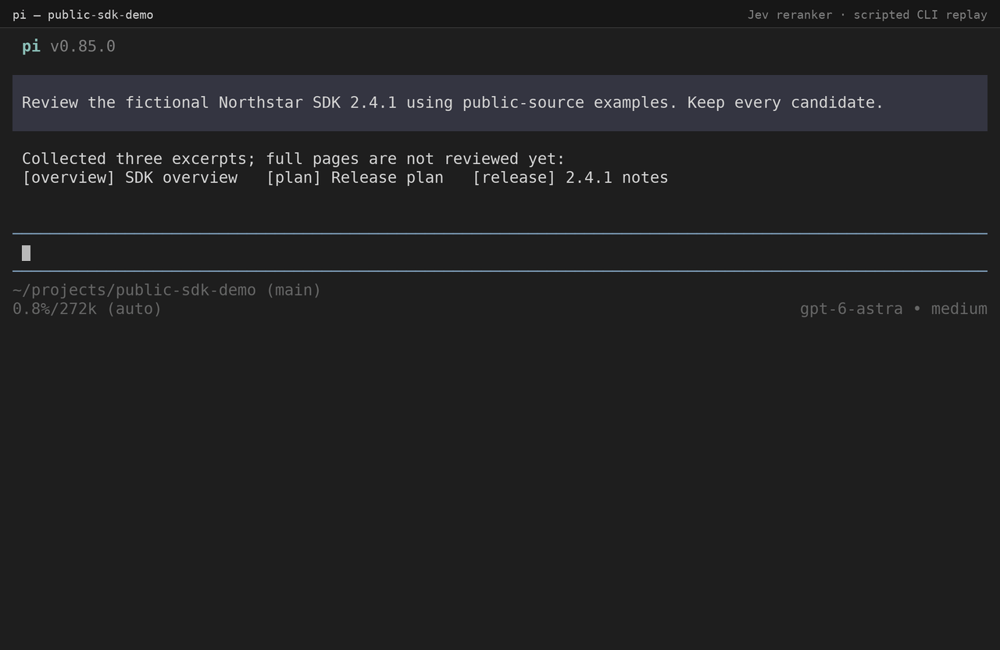
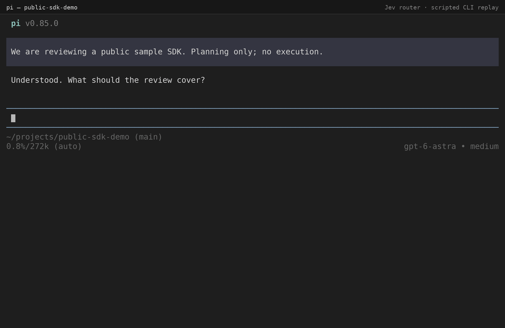

# Pi Jev

[](https://github.com/MDGChamomile/pi-jev/actions/workflows/validation.yml)
[](https://github.com/MDGChamomile/pi-jev/releases/latest)
[](LICENSE)

> Experimental purposeful reading for the [Pi coding agent](https://github.com/earendil-works/pi): give a path and a goal, receive relevant source excerpts—not another planning conversation.

The opt-in [`find_context` extension](extensions/pi-jev-context/README.md) performs bounded local file discovery, optionally uses TypeSafe Jev to rank candidates, and returns contiguous source text with file/line references and coverage limits. The parent supplies paths and a goal, not copied file bodies. Ordinary `read`, `bash`, `edit`, and `write` keep their existing roles. This is not a summarizer, a sandbox, a command runner, or whole-conversation compaction.

The original task router, public-web reranker, and shared workflow skill remain independently installable and retain their per-request full-payload review contracts. The root Git package still installs those legacy resources; **the new reader is an explicit experiment, not a silent upgrade of an active installation**.

**Status:** experimental and not published to npm. Offline tests establish mechanics, not live provider compatibility, code-search recall, natural tool adoption, or improvements in task accuracy, latency, or cost. Compare ordinary Pi, local-only reading, and Jev-assisted reading before retaining or expanding the feature. The router and reranker likewise have no established whole-task net benefit.

## Try purposeful reading separately

From a checked-out repository, load only the new extension and no discovered legacy skill:

```bash
pi --no-extensions --no-skills -e ./extensions/pi-jev-context/index.ts
```

This deliberately isolated launch also excludes other extensions; it is a test configuration, not a claim that their protections are inherited. The reader requires explicit local path authorization and separately distinguishes permission to send excerpts externally. Consult the [reader guide](extensions/pi-jev-context/README.md) before activation. Do not install into an active environment as a testing shortcut.

For a request such as “find where token-refresh retries stop,” Pi can call `find_context` with a relative path and that goal. The extension discovers bounded candidates locally, merges adjacent source windows, optionally ranks them, and returns original text and coverage. A limited or unsuccessful search is not proof that code does not exist. Use normal `read` for exact full-file review or patch preparation; references describe what was read, not an immutable snapshot.

The reader uses explicit, bounded activation rather than asking for approval on every invocation. Activation discloses the provider, project paths, request/input limits and cost limitations. Credentials alone never authorize sending files. Failures, exhausted budgets, or provider changes do not trigger retries or provider switching. The full contract and local-only mode are in the [reader guide](extensions/pi-jev-context/README.md).

Run the [offline reading evaluation](evaluations/context-reading/README.md) and separately assess whether normal user requests cause appropriate tool selection. No live Jev or end-to-end speed result is bundled. Web-search integration, automatic bash-output filtering, and conversation compaction are outside this experiment.

## Legacy advisory tools

### See the review flow

Scripted CLI walkthroughs of the review-and-approval workflow, using synthetic examples. The router demo predates the portable `delegate` route and removal of preset advice; follow the current router guide for output fields. Dialogue, tool catalogs, scores, model responses, and timing are illustrative—not live session recordings, benchmarks, or evidence of provider compatibility. No external requests were made to create these demos.

**Rerank collected passages** — the parent has several excerpts and an unresolved reading order. You review the complete payload and separately approve one request; Jev returns relevance advice, and the parent decides what to read next. Every candidate remains available.



**Advise on a task route** — the parent has not yet chosen between direct and delegated investigation. You review the task, constraints, and tool/skill metadata, then separately approve one request. Jev suggests a route; it does not execute or authorize it.



## Choose a tool

| Tool | Use it when | It does not |
|---|---|---|
| [`jev_task_router`](extensions/pi-jev-router/README.md) | Two or more feasible research, comparison, or review workflows remain unresolved, before choosing one; also for explicit routing evaluation. | Execute a route, activate tools, load skills, create subagents, or authorize actions. |
| [`jev_rerank`](extensions/pi-jev-tools/README.md) | Multiple usable public passages have been collected and reading order remains open, before reading all candidate sources in depth. | Search, fetch or verify sources, judge source authority, remove candidates, or write the answer. |

The shared [`pi-jev` skill](skills/pi-jev/README.md) teaches the parent agent when to use either available tool without requiring the user to name Jev. At these decision points, use the applicable tool once, subject to data and consent boundaries, without an additional speculative large-benefit test. Skip trivial tasks, user-specified or settled routes, and sufficient or fully reviewed evidence. Merely having several tools available does not justify routing. The skill itself does not contact a provider.

**Flow:** parent identifies an applicable decision point → you review the full payload and separately approve one request → Jev returns bounded advice → parent verifies sources and decides what to do. No automatic routing or answer-writing follows.

## Legacy package requirements and installation

- Node.js 22.22+ and Pi with `ctx.modelRegistry.getProviderAuth()` support. Offline loading and typechecking are pinned to Pi 0.85.0.
- Authentication for your selected connection: a configured Pi `openrouter` provider (default), or `TYPESAFE_API_KEY` for direct TypeSafe access. Neither extension reads credential files itself.
- An interactive Pi UI, or an RPC host implementing confirmation dialogs. Noninteractive modes fail closed.

### First-time setup

1. Choose and authenticate one connection below, and ensure the selected account can pay for the request. Keep keys out of prompts, tool arguments, and Git.
2. Install Pi Jev with the command below, then restart Pi or run `/reload`.
3. Run `/jev-router-status` or `/jev-rerank-status` to confirm the selected extension is loaded. These commands do not contact a provider or verify authentication. An actual call still requires payload review and separate approval.

**Optional tools, not prerequisites:** `pi-subagent` is not required, and no particular global `AGENTS.md` configuration is needed. The router can advise on direct handling and available tools or skills without a subagent. Acting on a delegation recommendation requires a compatible delegation tool; the router uses listed tool descriptions and does not prescribe tool-specific presets or arguments. See the [router guide](extensions/pi-jev-router/README.md). The reranker needs public excerpts collected beforehand, through your own web tools or supplied public sources; it does not include search or browser tools.

### Choose a connection

| Connection | Setup before starting Pi | Credential resolution after approval |
|---|---|---|
| OpenRouter (default) | Leave `PI_JEV_PROVIDER` unset, or set it to `openrouter`. In Pi, run `/login` and select OpenRouter; alternatively supply `OPENROUTER_API_KEY`. See [Pi provider authentication](https://github.com/earendil-works/pi/blob/main/packages/coding-agent/docs/providers.md). | Pi's `getProviderAuth('openrouter')`; no separate TypeSafe key needed. |
| TypeSafe direct | Obtain a key from the [TypeSafe dashboard](https://console.typesafe.ai/keys) and supply it securely as `TYPESAFE_API_KEY`. Start Pi with `PI_JEV_PROVIDER=typesafe`. | The selected extension reads `TYPESAFE_API_KEY`; OpenRouter authentication is not accessed. |

For example, once `TYPESAFE_API_KEY` is already available in your shell, run `PI_JEV_PROVIDER=typesafe pi`. The selection applies to both installed Jev extensions, not to Pi's main chat model. Restart Pi after changing its launch environment. No SDK, custom Pi model provider, or persistent settings change is needed. Unknown or empty selections return `invalid_provider`; missing credentials never trigger automatic provider switching. `/jev-router-status` and `/jev-rerank-status` show the configured connection without reading credentials.

**Cost:** OpenRouter enforces per-token price ceilings, **not a total bill limit**. TypeSafe direct has **neither an enforced per-token ceiling nor a total-cost cap** in this integration. Read [consent and cost](#legacy-external-transmission-consent-and-cost) and check your selected provider's pricing before approval.

Review the source, then install the single Pi package (both extensions and the shared skill):

```bash
pi install git:github.com/MDGChamomile/pi-jev
```

This unpinned source follows the repository's default branch. To update all three resources together:

```bash
pi update --extension git:github.com/MDGChamomile/pi-jev
```

Restart Pi or use `/reload` after updating. Use `pi config` to select which extensions and skills load. Existing copied or symlinked resources are not automatically removed: follow [`MIGRATION.md`](MIGRATION.md) before switching to avoid duplicates. A local development checkout is separate from this installation; uncommitted development edits do not update it.

Alternatively, preserve independent source-copy installation by copying the shared skill once and whichever extensions you need:

```bash
git clone https://github.com/MDGChamomile/pi-jev.git
cd pi-jev
mkdir -p ~/.pi/agent/extensions ~/.pi/agent/skills
cp -R skills/pi-jev ~/.pi/agent/skills/
cp -R extensions/pi-jev-router ~/.pi/agent/extensions/   # optional
cp -R extensions/pi-jev-tools ~/.pi/agent/extensions/    # optional
```

Restart Pi or use `/reload`. For an existing kit installation, follow [`MIGRATION.md`](MIGRATION.md) instead of overlaying old directories. Do not add Jev tools to a subagent's tool list.

To load one extension directly without copying it:

```bash
pi -e ./extensions/pi-jev-router/index.ts
# Or:
pi -e ./extensions/pi-jev-tools/index.ts
```

Git-package and independent source-copy installations are supported; this repository is not published to npm. No Python interpreter, TypeSafe SDK, or Jev-specific CLI flag is required at runtime. A TypeSafe key is needed only for the optional direct connection.

## Legacy external transmission, consent, and cost

For every invocation, the selected extension:

1. validates and snapshots the semantic request;
2. displays the complete immutable JSON payload for review;
3. requires a separate confirmation naming the selected provider, endpoint, model, request limit, applicable cost limitations, deadline, and data risks;
4. resolves only the selected connection's credential after approval; and
5. sends at most one request, with no automatic retry.

OpenRouter uses the fixed endpoint `https://openrouter.ai/api/alpha/decisions` and moving `~typesafe/jev-latest` alias. Requests disable provider fallbacks, restrict routing to TypeSafe, and set price ceilings of **$0.042/M input tokens** and **$0/M output tokens**. OpenRouter supplies no hard total-cost cap for this moving alias.

TypeSafe direct uses the fixed endpoint `https://api.typesafe.ai/v1/systemone` and moving `jev-latest` alias, following the [TypeSafe HTTP API](https://docs.typesafe.ai/api). Its body contains only model, state, and questions, not OpenRouter routing or price controls. The direct API documents no price-limit field, so this connection enforces **no per-token ceiling or total-cost cap**. Consult [TypeSafe pricing and model limits](https://docs.typesafe.ai/models); do not assume an advertised rate is an enforced spending limit. OpenRouter's optional USD response cost is preserved when supplied. The direct TypeSafe contract documents no cost field, so direct-call cost remains unknown, not zero.

Both connections have a 30-second HTTP deadline, reject redirects, and never retry or switch providers automatically. The connection is snapshotted with the payload before review; changes cannot redirect an approved request. The approval dialog discloses the selected connection's cost limitations. Taxes, currency conversion, and account-level billing behavior are outside these extensions.

Declining, editing the preview, losing UI availability, or cancelling before transmission returns a sanitized fallback without a provider request. Parent cancellation or session shutdown also stops an authentication wait, releases the invocation lock, and aborts an active HTTP request. Cancellation cannot retract data or charges after a request has been accepted.

## Legacy shared boundaries

- **Review is not DLP.** Never send secrets, credentials, session history, private files, internal documents, signed URLs, authenticated-page content, or data you are not authorized to disclose.
- **Reranking is public-web only.** URL checks reject obvious local or credential-bearing sources but do not prove that content is public. The extension does not fetch URLs or verify provenance.
- **Router metadata is disclosed.** Its payload includes active tool and discovered skill names and descriptions, which may originate in project resources. Inspect them before approval. The shared Jev workflow skill excludes itself from routing candidates.
- **Preserve semantics.** Write routing tasks and reranking questions/criteria in English while preserving names, numbers, dates, negation, uncertainty, scope, and plan-versus-execution distinctions. Reranking excerpts remain verbatim in their original language.
- **Advice is not authority.** Existing authorization, privacy, browser, tool, skill, and delegation rules still apply. Jev probabilities and confidence do not establish correctness.
- **Output is bounded and sanitized.** Review JSON visibly escapes invisible Unicode format controls while preserving the exact parsed request, including supplementary-plane characters. HTTP output is limited to 32KiB, and provider bodies and exception text are reduced to fixed failure codes.
- **One active invocation per extension.** Late authentication results and late review submissions are ignored after cancellation. There is no cache, shell call, child process, model-list request, or separate raw request/response log.

Pi may retain ordinary tool arguments and results in session history. Successful calls include non-persistent `elapsedMs`, `inputBytes`, and `questionCount` diagnostics; these are not proof of quality or billing totals.

## If Jev is not being used

Use `/jev-router-status` or `/jev-rerank-status` for the installed extension. Each command shows tool activation, in-memory runner calls, approved request attempts, pending state, the last completed result, and whether a validated response has previously been observed. It never checks authentication or contacts a provider. Counts reset on session start/switch/resume/fork/reload and do not establish delivery, billing, or whether the agent considered using Jev.

First distinguish no tool selection from a selected call returning `not_routed` or `not_ranked`. Confirm which extension and skill paths Pi actually loads, whether the tool is active, and the existing fixed failure code if a call failed. Reading the skill alone does not prove a tool was called. A source-copy installation does not change when this checkout changes; follow the migration guide before updating installed copies. Do not send session records to Jev or make a paid call merely to diagnose installation.

## Detailed guides

- [Purposeful reader activation, scope, limits, and fallback](extensions/pi-jev-context/README.md)
- [Purposeful reading evaluation and natural-use protocol](evaluations/context-reading/README.md)
- [Router input/output contract, failure codes, and limits](extensions/pi-jev-router/README.md)
- [Reranker input/output contract, failure codes, and limits](extensions/pi-jev-tools/README.md)
- [Shared skill guide](skills/pi-jev/README.md) and [workflow](skills/pi-jev/SKILL.md)
- [Migration](MIGRATION.md)
- [Contributing](CONTRIBUTING.md)
- [Harness principles (local pointer to the upstream source of truth)](PRINCIPLE.md)

## Offline verification

With this repository's locked development dependencies already installed, run:

```bash
npm run check
```

The suite uses mocked HTTP for both connections, synthetic keys, isolated Pi loading and credential-selection checks, TypeScript checks, and skill validation. It makes no provider request and does not establish live compatibility, routing quality, reranking quality, latency, or cost.

## Evaluation before automation

Start with the [small offline reranker comparison](evaluations/reranker/README.md): `npm run evaluate:reranker` reports ranking gains and harms on synthetic Korean fixtures using explicit handwritten mock orders. It can also compare separately collected results against an original-order or supplied parent-order baseline, with optional whole-task timing and quality observations. It never calls a provider; mock output establishes neither live quality nor net benefit. Missing measurements and cost remain unknown.

The decision-point guidance is an unvalidated selection hypothesis, not evidence of improved model behavior. Review it after the first small representative comparison and before expanding use. First compare old and new guidance with the same model, tools, skills, and public/synthetic tasks; count both missed applicable calls and unnecessary calls. Include varied cases rather than only these example phrasings:

| Situation | Expected selection |
|---|---|
| One typo fix or a user-specified lookup | Skip routing |
| Several tools are available, but the workflow is obvious | Skip routing |
| Parent-led versus delegated research remains unresolved | Route once, before settling the plan |
| Routing quality is explicitly being evaluated | Route once, subject to consent and permitted data |
| Several usable public excerpts need a reading order | Rerank once, before reading all sources in depth |
| A sufficient source answers the question, or all candidates are fully reviewed | Skip reranking |
| Public excerpts are paired with a private question | Do not send the prohibited input |
| Routing is followed by a distinct reading-priority decision | One routing call and one reranking call may apply; no automatic retry |

Selection-only evaluation can stop before execution without making a provider request; it cannot establish Jev's usefulness. Live evaluation requires separate authorization. Compare representative tasks with and without Jev, recording returned model IDs, important misses, unnecessary calls, source reads, total time including preparation and approval, token use, and actual cost (missing cost is unknown). Keep contradictory evidence available regardless of rank. If selection increases without a net benefit, narrow or revert the guidance; the router and reranker need not have the same outcome. Do not add silent calls, private-data routing, automatic execution, or broader integration merely because offline checks pass.

## License

[MIT](LICENSE); keep the extension-specific bundled licenses when copying directories.
