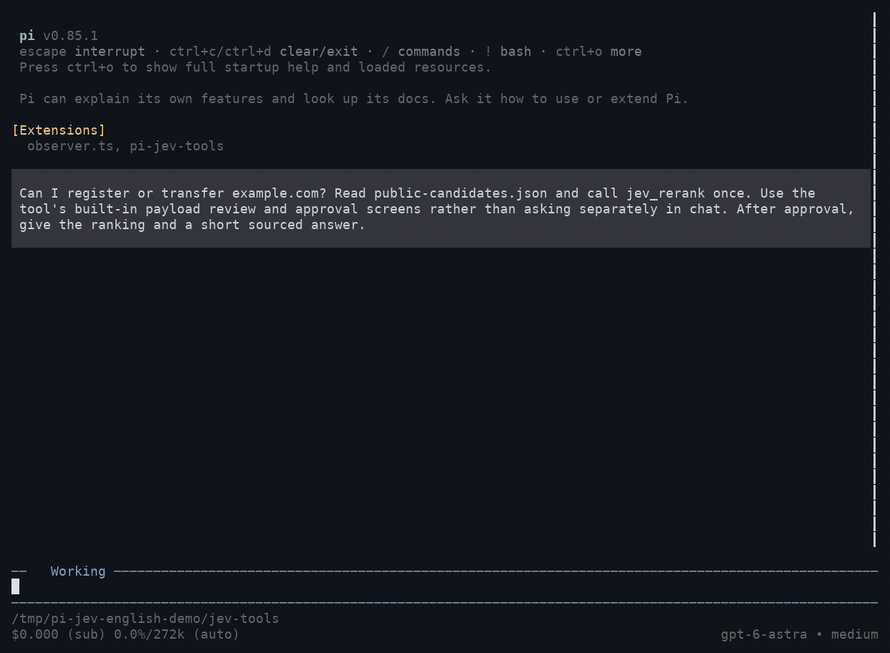

# Pi Jev Tools — experimental public-passage reranking

An optional `jev_rerank` tool for the **parent Pi agent**. It ranks already collected public web passages with TypeSafe Jev, after user review and confirmation. It does not search, write answers, replace a model, or modify another extension.

**Status:** experimental source implementation with offline tests and a live interactive demonstration using three public English passages. This does not establish Korean-language quality, general provider compatibility, or improvements in accuracy, latency, or cost. Start small; keep the extension only if comparison against the existing workflow shows a net benefit.

## In action

A real Pi run asks whether `example.com` can be registered or transferred. It reviews the complete payload, obtains separate approval, sends one TypeSafe request, and uses the returned order to give a sourced answer. The candidates are excerpts from IANA's public [Root Zone Management](https://www.iana.org/domains/root), [Time Zones](https://www.iana.org/time-zones), and [Example Domains](https://www.iana.org/help/example-domains) pages, collected before the recording.



The GIF replays actual terminal output with typing and waits accelerated; model responses and API results are not scripted. The demonstrated request returned `jev-1.13.0` for the `jev-latest` alias. This is a consent-flow demonstration, not a ranking-quality or latency benchmark. No private documents or personal sessions are used.

## Flow

1. The parent collects public candidates with its existing web tools.
2. The parent supplies an English question and evaluation criteria, with original-language excerpts.
3. The tool validates size, IDs and URL syntax. It shows the **entire request** in a scrollable editor for review. Submit it unchanged to proceed; cancel or edit it to stop without sending.
4. A separate confirmation names TypeSafe, the model, request count and deadline. Only explicit approval permits one API request.
5. Jev supplies one relevance Score per candidate. Code sorts the IDs by descending score, retaining every candidate. Ties preserve input order.
6. The parent reads original sources, or gives prioritized public URLs to a subagent, and writes the final answer.

There is no automatic hook into web results, no reading of saved response IDs, no session/history collection, and no child-agent integration. `jev_check_evidence` is not implemented.

## Requirements and use

- Node.js 22.22+ and Pi with the current extension API. Offline loading/typechecking was checked with Pi 0.85.1.
- An **existing** Python 3.10+ interpreter with `typesafe-sdk` installed. The SDK contract was checked offline with 0.6.0.
- `TYPESAFE_API_KEY` inherited by Pi from its execution environment. The extension never loads `.env`, searches for keys, or asks the model to read a credential file.
- An interactive Pi UI, or an RPC host implementing both editor and confirmation dialogs. Print/JSON mode fails closed with `confirmation_unavailable`. The demo exercises the interactive Pi UI; RPC rendering remains unverified.

The source does not install itself or add dependencies. After separately authorizing runtime use, load just this extension and point it at the existing interpreter:

```bash
pi -e ./live/extensions/pi-jev-tools/index.ts \
  --jev-python /absolute/path/to/existing/venv/bin/python
```

Do not put an API key in this command, in a tool argument, or in the repository. Missing interpreter configuration or a missing inherited key produces `not_ranked`; it does not trigger installation or credential discovery. The interpreter path must be absolute and is controlled by the operator, not the model's tool arguments.

Loading the extension registers only `jev_rerank` and its interpreter flag. It makes no network request at startup. Do not add it to a subagent's tool list; existing subagent capability boundaries are unchanged.

## Tool contract

```json
{
  "question": "Has the company completed its treasury-share cancellation?",
  "criteria": "Prioritize passages that establish execution status. Distinguish plans, board approval, and completed cancellation. Evidence of non-completion is relevant too.",
  "candidates": [
    {
      "id": "source_1",
      "url": "https://example.com/public-announcement",
      "title": "Synthetic public announcement example",
      "excerpt": "이사회는 다음 달 자사주를 소각하기로 결의했다."
    }
  ]
}
```

The example is synthetic, not an actual source. For real use, supply confirmed public URLs and accurate excerpts. Both web-search candidates and public candidates for subagent investigation use this same schema.

- `question` / `criteria`: English instructions written by the parent, at most 4,000 Unicode characters each. English is a caller contract, not an automated language-detection guarantee.
- Candidates: 1–10; unique IDs matching `[A-Za-z0-9_-]{1,64}`; public HTTP(S) URL up to 2,048 characters; title up to 500 characters; excerpt up to 4,000 characters.
- Prefer excerpts around 2,000 characters when context permits. Select relevant passages; never blindly cut off a document's first characters. Preserve negation, uncertainty, names, numbers, dates, quotes, and plan/execution distinctions.
- Both serialized tool input and the constructed semantic request (including generated questions) must fit **65,536 UTF-8 bytes**. Many near-limit excerpts may not fit together. Nothing is silently truncated or split into paid batches.
- `jev-latest` follows the latest stable model; the requested alias and provider-returned model ID are retained. No model-list request is made.
- One approval permits **one request**, with SDK retries disabled and a 30-second local process deadline. Time spent reviewing/confirming is not counted as API execution time.

Jev receives the English question, criteria, candidate IDs, URLs, titles, excerpts and generated English Score questions. Four fixed levels distinguish no useful evidence, background only, partial evidence, and direct evidence. Evidence contradicting a question's premise can score highly. Authority and truth are not part of this score.

Success returns `status: "ok"`, `requestedModel`, `model`, `originalOrder`, `rankedIds`, per-ID `score` (0–3), `confidence`, level `probabilities`, and token `usage`. Confidence describes distribution concentration, not factual correctness. Token usage is returned as tool metadata, not converted into an assumed price or Pi footer cost.

Failure/decline returns `status: "not_ranked"`, a fixed `code`, and the unchanged IDs. Examples: `declined`, `preview_changed`, `missing_key`, `python_not_configured`, `confirmation_unavailable`, `busy`, `rate_limited`, `timeout`, `cancelled`, `invalid_response`. Continue with the existing investigation; do not automatically retry. Invalid input throws a sanitized validation error before any dialog or process.

## Boundaries and limitations

- **Public web data only**, including the question and criteria. Do not send session contents, session-search output, private notes, local code, internal documents, signed URLs, or authenticated-page excerpts. A user approval inside this tool does not override other resources' privacy restrictions.
- URL checks reject obvious local/file/IP/credential-bearing sources but do **not** prove that a passage is public. They do not fetch URLs, verify provenance, perform DLP, or make private text safe because a public URL is attached. The parent and reviewing user must enforce that boundary.
- Candidate text is data, not instructions. Jev is not a security boundary or an authorization judge.
- No `.env` reads, shell invocation, document files, raw request/response logs, caches, or automatic collection. Input uses stdin, not command-line arguments. The child receives only the TypeSafe key and a locale; it does not inherit unrelated credentials or proxy settings. The endpoint is fixed to `https://api.typesafe.ai`.
- Pi may retain normal tool arguments and results in its session history. This extension adds no separate raw-content log. SDK/OS error text and stderr are never returned to the model; only fixed error codes are exposed.
- Only one invocation can be pending per extension instance, including review. Parallel calls return `busy`. Cancelling or shutting down kills an active adapter; a pending editor may need to be closed manually, but cannot send after cancellation. Cancellation cannot retract data or charges from a request already accepted by the provider.
- Requests are constrained by bytes, not an exact tokenizer. A request within 64KiB may still exceed provider token limits and fail without retry.
- Reranking cannot recover candidates omitted by the initial search. It can misrank useful material. Keep the original candidates available and do not treat a low score as a deletion rule.

## Offline verification

From the repository root, without installing anything:

```bash
node --test live/extensions/pi-jev-tools/tests/core.test.mjs
python3 -B -m unittest discover -s live/extensions/pi-jev-tools/tests -v
```

The Python tests skip two SDK-contract tests if the SDK is absent. To include them, run the same unittest command with the existing SDK interpreter. These tests use `httpx2.MockTransport`, synthetic credentials and blocked socket connections; they do not make provider calls or read a real key.

For TypeScript checking and an offline Pi extension-load test, provide existing package directories:

```bash
node live/extensions/pi-jev-tools/tests/pi-check.mjs \
  /absolute/path/to/pi-coding-agent \
  /absolute/path/to/typescript
```

This checks the thin TypeScript entrypoint against the installed Pi types (`core.mjs` is covered by runtime tests, not strict JS checking), loads only this extension with Pi's loader, and tests refusal without a UI. It does not start an agent or send a prompt to a model.

Tests cover request preservation and limits, ID mapping, stable sorting, malformed replies, unchanged fallback, confirmation gates, concurrent calls, cancellation, deadlines, subprocess environment isolation, bounded output, sanitized errors, real SDK request serialization via mock transport, and zero retries for 429.

## Opt-in evaluation, not yet performed

With separate authorization, compare public/synthetic Korean tasks with and without reranking. Measure top-k useful-evidence coverage, important evidence demotion, total source reads, end-to-end latency and actual token use. Compare English instructions plus Korean originals against originals with explicitly marked English translations, without adding another translation service. Use the same candidate pools and record the actual model IDs.

The 10-candidate / 4,000-character / 64KiB limits are provisional operating bounds, not validated optima. Revisit them after representative evaluation; do not expand to automatic calls, private-data workflows or direct child access merely because offline checks pass.

## References

- [TypeSafe Score](https://docs.typesafe.ai/primitives/score)
- [Reranking cookbook](https://docs.typesafe.ai/cookbooks/rerank_typesafe)
- [Python SDK](https://docs.typesafe.ai/sdk/python)
- [Models and limitations](https://docs.typesafe.ai/models)

MIT; keep the bundled `LICENSE` when copying the directory.
